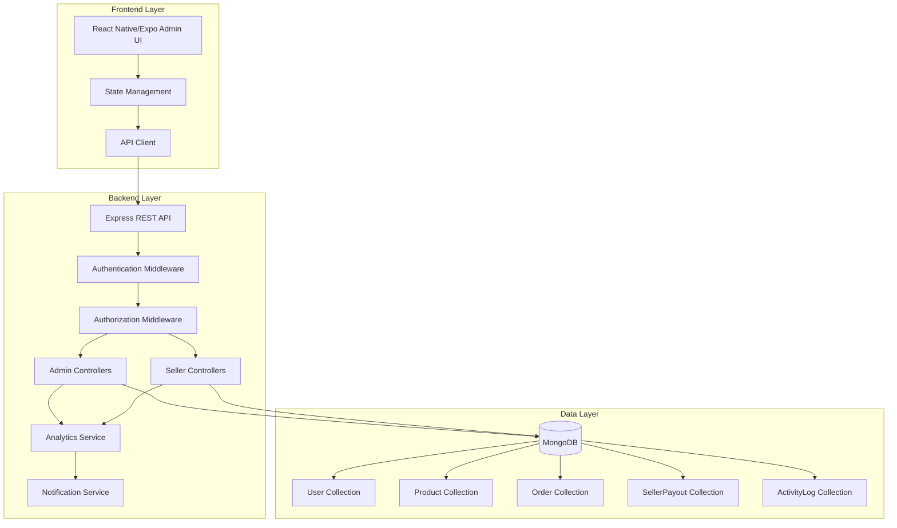
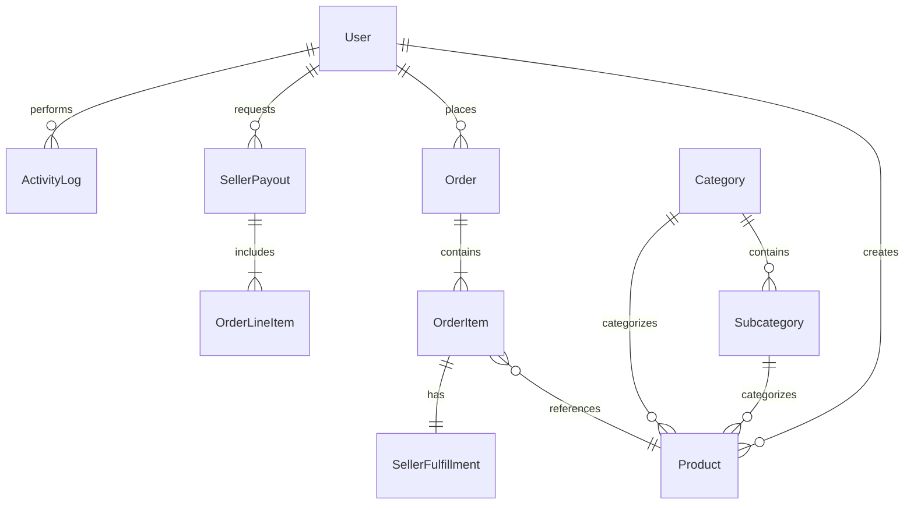

# Design Document: Admin Panel Enhancement

## Overview

This design document outlines the technical approach for enhancing the Hand Craft Jewelry E-commerce admin panel. The enhancement encompasses three major initiatives:

1. **Audit and Fix Existing Features**: Systematically identify and repair all non-functional admin features
2. **Seller Management System**: Implement comprehensive seller lifecycle management including approval workflows, profile management, payout processing, and performance tracking
3. **UI/UX Modernization**: Redesign the admin interface with modern, responsive components and improved user experience

The system consists of a Node.js/Express backend with MongoDB database and a React Native/Expo frontend. The design prioritizes reliability, maintainability, and scalability while ensuring all admin functions achieve 100% operational reliability.

### Design Goals

- **Reliability**: All admin features must work consistently without errors
- **Maintainability**: Code should be well-structured, documented, and testable
- **Usability**: Admin interface should be intuitive and efficient for daily operations
- **Performance**: Admin operations should complete within acceptable time limits (< 2 seconds for most operations)
- **Security**: Proper authentication, authorization, and data validation throughout
- **Scalability**: Architecture should support growing data volumes and user base

## Architecture

### System Architecture

The admin panel follows a three-tier architecture:



````

### Architectural Patterns

**1. Layered Architecture**
- **Presentation Layer**: React Native components with responsive design
- **API Layer**: RESTful endpoints with consistent response formats
- **Business Logic Layer**: Controllers and services implementing business rules
- **Data Access Layer**: Mongoose models with schema validation

**2. Middleware Pipeline**
- Authentication verification (JWT tokens)
- Role-based authorization checks
- Request validation
- Error handling
- Activity logging

**3. Service-Oriented Design**
- Analytics Service: Centralized metrics calculation and reporting
- Notification Service: Email and in-app notifications
- Audit Service: Activity logging and compliance tracking
- Payout Service: Seller payment processing logic

### Technology Stack

**Backend**:
- Node.js v18+ with Express 5.x
- MongoDB 7.x with Mongoose ODM
- JWT for authentication
- Bcrypt for password hashing
- Multer for file uploads
- Nodemailer for email notifications

**Frontend**:
- React Native with Expo
- React Navigation for routing
- Axios for API communication
- AsyncStorage for local caching
- Chart libraries for data visualization

**Testing**:
- Jest for unit and integration testing
- Supertest for API endpoint testing
- React Native Testing Library for component testing

## Components and Interfaces

### Backend Components

#### 1. Admin Audit System

**Purpose**: Systematically test and identify broken admin features

**Components**:
- `AuditRunner`: Orchestrates audit execution
- `EndpointTester`: Tests API endpoints with various scenarios
- `DatabaseValidator`: Verifies database connectivity and schema integrity
- `AuthTester`: Validates authentication and authorization
- `ReportGenerator`: Generates comprehensive audit reports

**Interface**:
```javascript
class AuditRunner {
  async runFullAudit() {
    // Returns AuditReport with all findings
  }

  async testEndpoint(endpoint, testCases) {
    // Returns EndpointTestResult
  }

  async generateReport(findings) {
    // Returns formatted AuditReport
  }
}
````

#### 2. Seller Management Module

**Purpose**: Handle complete seller lifecycle from application to payout

**Components**:

- `SellerApplicationController`: Manages seller applications and approvals
- `SellerProfileController`: Handles seller profile CRUD operations
- `SellerPayoutController`: Processes payout requests and payments
- `SellerAnalyticsService`: Calculates seller performance metrics

**Key Endpoints**:

```
POST   /api/admin/sellers/applications/:id/approve
POST   /api/admin/sellers/applications/:id/reject
GET    /api/admin/sellers
GET    /api/admin/sellers/:id
PUT    /api/admin/sellers/:id
POST   /api/admin/sellers/:id/suspend
POST   /api/admin/sellers/:id/reactivate
GET    /api/admin/sellers/payouts
POST   /api/admin/sellers/payouts/:id/approve
POST   /api/admin/sellers/payouts/:id/reject
GET    /api/admin/sellers/analytics
```

#### 3. Enhanced Admin Controllers

**Purpose**: Fix and enhance existing admin functionality

**Controllers to Fix/Enhance**:

- `AdminController`: Dashboard stats and overview
- `UserManagementController`: User CRUD with improved validation
- `ProductManagementController`: Product oversight with status management
- `OrderManagementController`: Order processing and fulfillment
- `CategoryController`: Category hierarchy management
- `CouponController`: Promotional code management
- `BlogController`: Content management
- `SupportTicketController`: Customer service management
- `InventoryController`: Stock level monitoring
- `PaymentOpsController`: Financial transaction oversight

#### 4. Analytics Service

**Purpose**: Centralized metrics calculation and reporting

**Interface**:

```javascript
class AnalyticsService {
  async getDashboardMetrics() {
    // Returns comprehensive dashboard statistics
  }

  async getSellerPerformance(sellerId, dateRange) {
    // Returns seller-specific metrics
  }

  async getRevenueAnalytics(dateRange) {
    // Returns revenue breakdown and trends
  }

  async getOrderAnalytics(dateRange) {
    // Returns order statistics and patterns
  }
}
```

#### 5. Activity Logging Service

**Purpose**: Track all administrative actions for audit trail

**Interface**:

```javascript
class ActivityLogService {
  async logAction(userId, action, resource, details) {
    // Creates activity log entry
  }

  async getActivityLogs(filters) {
    // Returns paginated activity logs
  }

  async exportLogs(filters, format) {
    // Exports logs to CSV
  }
}
```

### Frontend Components

#### 1. Dashboard Components

**DashboardOverview**:

- Key performance indicators (KPIs) display
- Revenue and order trend charts
- Recent activity feed
- Alert notifications (low stock, pending applications)

**MetricCard**:

- Reusable component for displaying single metrics
- Support for trend indicators (up/down arrows)
- Click-through to detailed views

**ChartComponents**:

- LineChart: Revenue trends over time
- PieChart: Order status distribution
- BarChart: Top products and sellers
- Responsive and interactive with tooltips

#### 2. Data Table Components

**DataTable**:

- Sortable columns
- Pagination controls
- Row selection for bulk operations
- Responsive (card layout on mobile)
- Search and filter integration

**TableFilters**:

- Multi-criteria filtering
- Date range pickers
- Status dropdowns
- Clear all filters button

**BulkActions**:

- Bulk status updates
- Bulk delete with confirmation
- Progress indicators
- Success/failure summary

#### 3. Form Components

**FormField**:

- Input validation with error messages
- Support for text, number, email, date, select
- Inline validation feedback
- Accessibility compliant

**FormValidation**:

- Client-side validation before submission
- Field-specific error display
- Form-level error summary
- Success notifications

#### 4. Seller Management Components

**SellerApplicationList**:

- Pending applications display
- Quick approve/reject actions
- Application detail modal

**SellerProfileView**:

- Complete seller information display
- Edit mode with validation
- Performance metrics visualization
- Product listing

**PayoutRequestList**:

- Pending payout requests
- Seller balance calculation
- Approve/reject with reason
- Payment history

#### 5. Navigation Components

**Sidebar**:

- Categorized menu sections
- Active section highlighting
- Notification badges
- Collapsible on mobile

**Breadcrumbs**:

- Current location hierarchy
- Clickable navigation path
- Auto-generated from route

**Header**:

- User profile dropdown
- Notification center
- Quick search
- Logout button

### API Response Formats

**Standard Success Response**:

```json
{
  "success": true,
  "data": {
    /* response data */
  },
  "message": "Operation completed successfully",
  "timestamp": "2024-01-15T10:30:00Z"
}
```

**Standard Error Response**:

```json
{
  "success": false,
  "error": {
    "code": "VALIDATION_ERROR",
    "message": "Invalid input data",
    "details": [
      {
        "field": "email",
        "message": "Invalid email format"
      }
    ]
  },
  "timestamp": "2024-01-15T10:30:00Z"
}
```

**Paginated Response**:

```json
{
  "success": true,
  "data": [
    /* array of items */
  ],
  "pagination": {
    "page": 1,
    "limit": 20,
    "total": 150,
    "pages": 8
  },
  "timestamp": "2024-01-15T10:30:00Z"
}
```

## Data Models

### Enhanced User Model

The existing User model already supports seller functionality. Key fields for admin panel:

```javascript
{
  role: 'user' | 'seller' | 'admin',
  sellerStatus: 'inactive' | 'pending' | 'approved' | 'rejected' | 'suspended',
  sellerProfile: {
    shopName: String,
    shopSlug: String,
    bio: String,
    logo: String,
    banner: String,
    contactEmail: String,
    contactPhone: String,
    // Address fields
    // Social media
    // Policies
    // Bank information
    bankName: String,
    accountHolderName: String,
    accountNumber: String,
    routingNumber: String,
    payoutEmail: String
  }
}
```

### New: SellerPayout Model

```javascript
const sellerPayoutSchema = new mongoose.Schema(
  {
    seller: {
      type: mongoose.Schema.Types.ObjectId,
      ref: "User",
      required: true,
      index: true,
    },

    requestDate: {
      type: Date,
      default: Date.now,
      required: true,
    },

    amount: {
      type: Number,
      required: true,
      min: 0,
    },

    status: {
      type: String,
      enum: ["pending", "approved", "paid", "rejected", "cancelled"],
      default: "pending",
      index: true,
    },

    orderLineItems: [
      {
        order: {
          type: mongoose.Schema.Types.ObjectId,
          ref: "Order",
        },
        orderNumber: String,
        itemIndex: Number,
        amount: Number,
      },
    ],

    bankDetails: {
      bankName: String,
      accountHolderName: String,
      accountNumber: String,
      routingNumber: String,
      payoutEmail: String,
    },

    processedBy: {
      type: mongoose.Schema.Types.ObjectId,
      ref: "User",
    },

    processedDate: Date,

    paymentReference: String,

    rejectionReason: String,

    notes: String,
  },
  { timestamps: true },
);
```

### New: ActivityLog Model

```javascript
const activityLogSchema = new mongoose.Schema(
  {
    user: {
      type: mongoose.Schema.Types.ObjectId,
      ref: "User",
      required: true,
      index: true,
    },

    userName: {
      type: String,
      required: true,
    },

    action: {
      type: String,
      required: true,
      enum: [
        "create",
        "update",
        "delete",
        "approve",
        "reject",
        "suspend",
        "reactivate",
        "login",
        "logout",
      ],
      index: true,
    },

    resourceType: {
      type: String,
      required: true,
      enum: [
        "user",
        "product",
        "order",
        "category",
        "subcategory",
        "coupon",
        "blog",
        "support_ticket",
        "seller_application",
        "seller_payout",
        "inventory",
      ],
      index: true,
    },

    resourceId: {
      type: mongoose.Schema.Types.ObjectId,
      index: true,
    },

    resourceName: String,

    changes: {
      before: mongoose.Schema.Types.Mixed,
      after: mongoose.Schema.Types.Mixed,
    },

    ipAddress: String,

    userAgent: String,

    timestamp: {
      type: Date,
      default: Date.now,
      index: true,
    },
  },
  { timestamps: true },
);

// TTL index for automatic deletion after 90 days
activityLogSchema.index({ timestamp: 1 }, { expireAfterSeconds: 7776000 });
```

### Enhanced Order Model

The existing Order model already has seller fulfillment tracking. Key fields:

```javascript
{
  items: [
    {
      sellerFulfillment: {
        seller: ObjectId,
        shopName: String,
        status: String,
        grossAmount: Number,
        platformFeeRate: Number,
        platformFeeAmount: Number,
        sellerNetAmount: Number,
        payoutStatus:
          "unpaid" | "available" | "requested" | "paid" | "reversed",
      },
    },
  ];
}
```

### Data Relationships



## Error Handling

### Error Classification

**1. Validation Errors (400)**:

- Invalid input format
- Missing required fields
- Business rule violations
- Example: "Email format is invalid"

**2. Authentication Errors (401)**:

- Missing or invalid JWT token
- Expired session
- Example: "Authentication required"

**3. Authorization Errors (403)**:

- Insufficient permissions
- Role-based access denial
- Example: "Admin access required"

**4. Not Found Errors (404)**:

- Resource doesn't exist
- Invalid ID
- Example: "User not found"

**5. Conflict Errors (409)**:

- Duplicate entries
- State conflicts
- Example: "Email already exists"

**6. Server Errors (500)**:

- Database connection failures
- Unexpected exceptions
- External service failures
- Example: "Internal server error"

### Error Handling Strategy

**Backend Error Middleware**:

```javascript
const errorHandler = (err, req, res, next) => {
  // Log error details
  logger.error({
    message: err.message,
    stack: err.stack,
    url: req.url,
    method: req.method,
    user: req.user?._id,
  });

  // Determine error type and status code
  const statusCode = err.statusCode || 500;
  const errorCode = err.code || "INTERNAL_ERROR";

  // Send appropriate response
  res.status(statusCode).json({
    success: false,
    error: {
      code: errorCode,
      message: err.message,
      details: err.details || [],
    },
    timestamp: new Date().toISOString(),
  });
};
```

**Frontend Error Handling**:

- Display user-friendly error messages
- Provide retry options for network errors
- Log errors for debugging
- Show field-specific validation errors
- Display toast notifications for operation results

### Validation Strategy

**Backend Validation**:

- Schema-level validation (Mongoose)
- Controller-level business logic validation
- Middleware for common validations
- Sanitize inputs to prevent injection attacks

**Frontend Validation**:

- Real-time field validation
- Form-level validation before submission
- Consistent validation rules with backend
- Clear error messaging

**Common Validation Rules**:

- Email: RFC 5322 format
- Phone: E.164 format (optional)
- Passwords: Minimum 6 characters (already hashed)
- Prices: Non-negative numbers with 2 decimal places
- Dates: ISO 8601 format, future dates where applicable
- URLs: Valid HTTP/HTTPS format
- File uploads: Type and size restrictions

## Testing Strategy

### Testing Approach

This feature involves primarily CRUD operations, UI components, and infrastructure work. **Property-based testing is NOT appropriate** for this feature because:

1. **UI Rendering**: Admin panel components are visual interfaces, not pure functions
2. **CRUD Operations**: Simple database operations with specific business rules
3. **Infrastructure**: API endpoints, authentication, and authorization
4. **External Dependencies**: Database, file system, email service

Instead, we will use:

- **Unit Tests**: Test individual functions and business logic
- **Integration Tests**: Test API endpoints end-to-end
- **Component Tests**: Test React Native components
- **Manual Testing**: UI/UX validation and exploratory testing

### Unit Testing

**Scope**: Individual functions, services, and utilities

**Coverage Goals**: Minimum 80% code coverage

**Test Cases**:

- Analytics calculations (revenue, averages, counts)
- Validation functions (email, phone, price formats)
- Data transformation utilities
- Business logic (payout calculations, status transitions)
- Error handling paths

**Example Test Structure**:

```javascript
describe("AnalyticsService", () => {
  describe("calculateSellerPerformance", () => {
    it("should calculate gross sales correctly", async () => {
      // Arrange: Create test data
      // Act: Call function
      // Assert: Verify results
    });

    it("should handle sellers with no orders", async () => {
      // Test edge case
    });

    it("should filter by date range", async () => {
      // Test filtering logic
    });
  });
});
```

### Integration Testing

**Scope**: API endpoints with database interactions

**Test Cases**:

- Authentication and authorization flows
- CRUD operations for all resources
- Pagination and filtering
- Error responses for invalid inputs
- Status transitions (order fulfillment, seller approval)
- Bulk operations

**Example Test Structure**:

```javascript
describe("POST /api/admin/sellers/applications/:id/approve", () => {
  it("should approve seller application with valid admin token", async () => {
    const response = await request(app)
      .post(`/api/admin/sellers/applications/${sellerId}/approve`)
      .set("Authorization", `Bearer ${adminToken}`)
      .expect(200);

    expect(response.body.success).toBe(true);
    expect(response.body.data.sellerStatus).toBe("approved");
  });

  it("should reject request without admin token", async () => {
    await request(app)
      .post(`/api/admin/sellers/applications/${sellerId}/approve`)
      .expect(401);
  });

  it("should return 404 for non-existent seller", async () => {
    await request(app)
      .post("/api/admin/sellers/applications/invalid-id/approve")
      .set("Authorization", `Bearer ${adminToken}`)
      .expect(404);
  });
});
```

### Component Testing

**Scope**: React Native UI components

**Test Cases**:

- Component rendering with various props
- User interactions (clicks, form submissions)
- Conditional rendering based on state
- Error state display
- Loading states

**Example Test Structure**:

```javascript
describe("DataTable", () => {
  it("should render table with data", () => {
    const { getByText } = render(
      <DataTable data={mockData} columns={mockColumns} />,
    );
    expect(getByText(mockData[0].name)).toBeTruthy();
  });

  it("should call onSort when column header clicked", () => {
    const onSort = jest.fn();
    const { getByText } = render(
      <DataTable data={mockData} columns={mockColumns} onSort={onSort} />,
    );
    fireEvent.press(getByText("Name"));
    expect(onSort).toHaveBeenCalledWith("name");
  });
});
```

### Validation Testing

**Scope**: Data validation rules enforcement

**Test Cases**:

- Required field validation
- Format validation (email, phone, URL)
- Range validation (prices, dates)
- Business rule validation (status transitions)
- Duplicate prevention

### Authentication and Authorization Testing

**Scope**: Security controls

**Test Cases**:

- JWT token validation
- Role-based access control
- Permission checks for each endpoint
- Token expiration handling
- Self-deletion prevention

### Performance Testing

**Scope**: Response time and scalability

**Test Cases**:

- Dashboard load time < 2 seconds
- API response times < 2 seconds for standard operations
- Pagination performance with large datasets
- Concurrent user handling
- Database query optimization

### Manual Testing Checklist

**UI/UX Validation**:

- [ ] Responsive design on various screen sizes
- [ ] Touch-friendly buttons on mobile
- [ ] Consistent styling and branding
- [ ] Intuitive navigation
- [ ] Clear error messages
- [ ] Loading indicators
- [ ] Success notifications

**Functional Validation**:

- [ ] All CRUD operations work correctly
- [ ] Search and filtering produce expected results
- [ ] Bulk operations complete successfully
- [ ] File uploads work with valid files
- [ ] Export functionality generates correct files
- [ ] Real-time notifications appear
- [ ] Activity logging captures all actions

**Cross-Browser Testing**:

- [ ] Chrome/Edge
- [ ] Firefox
- [ ] Safari
- [ ] Mobile browsers (iOS Safari, Android Chrome)

### Test Data Management

**Test Database**:

- Separate test database for integration tests
- Seed data for consistent test scenarios
- Cleanup after each test suite

**Mock Data**:

- Realistic test data generators
- Edge case scenarios (empty lists, maximum values)
- Invalid data for error testing

### Continuous Integration

**CI Pipeline**:

1. Run linter (ESLint)
2. Run unit tests
3. Run integration tests
4. Generate coverage report
5. Fail build if coverage < 80%

**Pre-commit Hooks**:

- Run linter
- Run unit tests for changed files
- Validate commit message format

## Implementation Phases

### Phase 1: Audit and Foundation (Week 1-2)

**Objectives**:

- Identify all broken features
- Set up testing infrastructure
- Create activity logging system

**Deliverables**:

- Comprehensive audit report
- Test framework setup
- ActivityLog model and service
- Error handling middleware

### Phase 2: Fix Core Admin Functions (Week 3-4)

**Objectives**:

- Fix user management
- Fix product management
- Fix order management
- Fix category/coupon/blog management

**Deliverables**:

- Working CRUD operations for all resources
- Proper validation and error handling
- Unit and integration tests
- API documentation

### Phase 3: Seller Management Implementation (Week 5-6)

**Objectives**:

- Implement seller approval workflow
- Implement seller profile management
- Implement payout system
- Implement seller analytics

**Deliverables**:

- SellerPayout model
- Seller management endpoints
- Payout processing logic
- Seller performance metrics

### Phase 4: UI/UX Modernization (Week 7-8)

**Objectives**:

- Redesign dashboard
- Implement modern navigation
- Create reusable components
- Implement data visualization

**Deliverables**:

- Modern dashboard UI
- Responsive navigation
- Chart components
- Data table components
- Form components

### Phase 5: Advanced Features (Week 9-10)

**Objectives**:

- Implement bulk operations
- Implement export functionality
- Implement real-time notifications
- Implement role-based access control

**Deliverables**:

- Bulk action functionality
- CSV export
- Notification system
- Permission management

### Phase 6: Testing and Optimization (Week 11-12)

**Objectives**:

- Comprehensive testing
- Performance optimization
- Bug fixes
- Documentation

**Deliverables**:

- Complete test coverage
- Performance benchmarks
- Bug-free system
- User documentation
- Developer documentation

## Security Considerations

### Authentication

- JWT tokens with expiration
- Secure token storage (httpOnly cookies or secure storage)
- Token refresh mechanism
- Logout functionality

### Authorization

- Role-based access control (RBAC)
- Permission checks on every endpoint
- Prevent privilege escalation
- Audit trail for all actions

### Data Protection

- Password hashing with bcrypt
- Sensitive data encryption (bank details)
- Input sanitization
- SQL injection prevention (Mongoose handles this)
- XSS prevention

### API Security

- Rate limiting to prevent abuse
- CORS configuration
- Helmet.js security headers
- Request size limits
- File upload restrictions

### Activity Monitoring

- Log all administrative actions
- Track failed login attempts
- Monitor suspicious patterns
- Alert on critical operations

## Performance Optimization

### Backend Optimization

- Database indexing on frequently queried fields
- Pagination for large datasets
- Caching frequently accessed data
- Efficient aggregation queries
- Connection pooling

### Frontend Optimization

- Lazy loading for images and components
- Debouncing search inputs
- Caching API responses
- Virtual scrolling for long lists
- Code splitting

### Database Optimization

**Indexes**:

```javascript
// User indexes
userSchema.index({ email: 1 });
userSchema.index({ role: 1, sellerStatus: 1 });

// Order indexes
orderSchema.index({ user: 1, createdAt: -1 });
orderSchema.index({ paymentStatus: 1 });
orderSchema.index({ status: 1 });

// Product indexes
productSchema.index({ seller: 1, status: 1 });
productSchema.index({ category: 1, subcategory: 1 });

// SellerPayout indexes
sellerPayoutSchema.index({ seller: 1, status: 1 });
sellerPayoutSchema.index({ status: 1, requestDate: -1 });

// ActivityLog indexes
activityLogSchema.index({ user: 1, timestamp: -1 });
activityLogSchema.index({ resourceType: 1, action: 1 });
activityLogSchema.index({ timestamp: 1 }, { expireAfterSeconds: 7776000 });
```

## Deployment Considerations

### Environment Configuration

- Separate configurations for development, staging, production
- Environment variables for sensitive data
- Feature flags for gradual rollout

### Database Migration

- Backup existing data before deployment
- Run migration scripts for new models
- Verify data integrity after migration

### Rollback Plan

- Version control for all changes
- Database backup before deployment
- Ability to revert to previous version
- Monitoring for post-deployment issues

### Monitoring

- Application performance monitoring
- Error tracking and alerting
- Database performance metrics
- User activity analytics

## Conclusion

This design provides a comprehensive approach to enhancing the admin panel with reliability, usability, and maintainability as core principles. The phased implementation allows for incremental delivery and testing, ensuring each component works correctly before moving to the next phase.

The architecture supports future scalability and extensibility, with clear separation of concerns and well-defined interfaces. The testing strategy ensures high code quality and reliability, while the security considerations protect sensitive data and prevent unauthorized access.

By following this design, the admin panel will achieve 100% operational reliability and provide administrators with a modern, efficient tool for managing the e-commerce platform.
