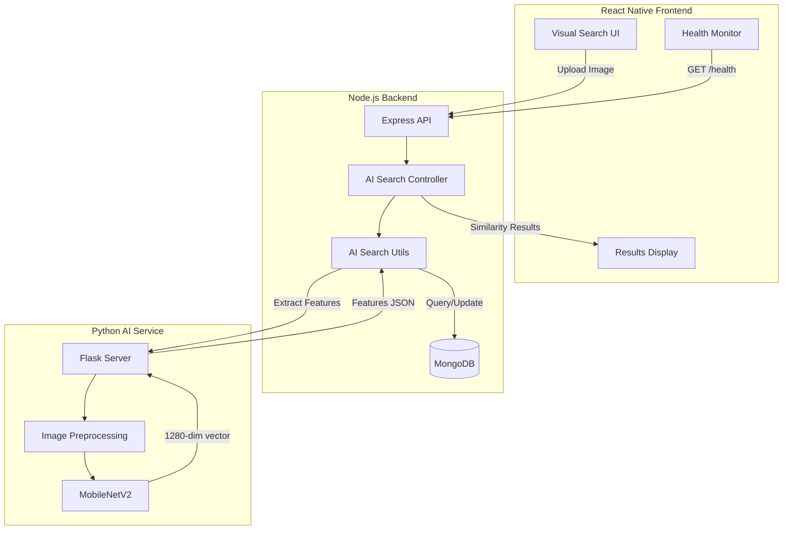

# Technical Design Document: AI Product Identification Enhancement

## Overview

This design document specifies the technical architecture for enhancing the AI Product Identification module in a handcrafted jewelry e-commerce platform. The system enables visual product search by extracting feature vectors from product images using MobileNetV2 and computing similarity scores through cosine distance.

### System Context

The enhancement builds upon an existing implementation with three primary components:

1. **Python AI Service** (Flask, port 5001): Extracts 1280-dimensional feature vectors from images using pre-trained MobileNetV2
2. **Node.js Backend** (Express): Manages product catalog, coordinates indexing, handles visual search requests
3. **React Native Frontend** (Expo): Provides mobile UI for visual search and health monitoring

### Enhancement Goals

- **Robustness**: Comprehensive error handling for service unavailability, image validation failures, and indexing errors
- **Performance**: Optimized queries, model preloading, efficient similarity computation
- **Accuracy**: EXIF-aware preprocessing, alpha channel handling, consistent normalization
- **Maintainability**: Clear separation of concerns, comprehensive health monitoring, automatic index maintenance
- **User Experience**: Intuitive visual search interface, real-time status feedback, actionable error messages

## Architecture

### High-Level Architecture



````

### Component Interaction Flow

**Visual Search Flow:**
1. User uploads image via React Native UI
2. Frontend sends multipart/form-data to `/api/ai-search/search`
3. Backend saves temporary file, calls AI Service `/extract` endpoint
4. AI Service preprocesses image (EXIF rotation, alpha handling, resize to 224x224)
5. MobileNetV2 extracts 1280-dim feature vector with L2 normalization
6. Backend loads indexed products from MongoDB (with `+features` selection)
7. Backend computes cosine similarity for each product
8. Backend filters by minimum threshold (0.18), ranks by score
9. Backend applies tie-breaking (stock status, featured flag)
10. Backend returns top 12 matches with similarity scores
11. Frontend displays results with match quality labels

**Indexing Flow:**
1. Admin triggers indexing via `/api/ai-search/index-all` or `/api/ai-search/index/:id`
2. Backend retrieves products with images from MongoDB
3. For each product, backend resolves image path (local uploads or URL)
4. Backend calls AI Service with image file or URL
5. AI Service extracts features and returns vector
6. Backend stores features, sets `featuresIndexed: true`, saves image signature
7. Backend returns indexing statistics (indexed, skipped, failed counts)

**Auto-Maintenance Flow:**
1. Product model pre-save hook detects `thumbnailImage` or `images` modification
2. Hook clears `features`, sets `featuresIndexed: false`, clears `featuresImageSignature`
3. Background queue triggers re-indexing via `queueProductAiRefresh()`
4. Re-indexing extracts fresh features and updates product document

### Technology Stack

**Python AI Service:**
- Flask 2.x (web framework)
- TensorFlow 2.x (MobileNetV2 model)
- Pillow (PIL) 10.x (image preprocessing)
- NumPy (array operations)
- Requests (URL-based image download)

**Node.js Backend:**
- Express 4.x (web framework)
- Mongoose 7.x (MongoDB ODM)
- Axios (HTTP client for AI Service)
- Multer (multipart file upload)
- Form-Data (multipart form construction)

**React Native Frontend:**
- Expo SDK 50+ (mobile framework)
- Expo Image Picker (gallery/camera access)
- Axios (HTTP client)
- React Navigation (routing)

## Components and Interfaces

### Python AI Service Components

#### Flask Application (`app.py`)

**Responsibilities:**
- Expose REST API endpoints for feature extraction and health checks
- Load and manage MobileNetV2 model lifecycle
- Handle CORS for cross-origin requests
- Validate request payloads and image sizes
- Log operations and errors

**Key Functions:**

```python
def load_model():
    """Load MobileNetV2 with ImageNet weights, exclude top classification layer"""
    # Returns: tf.keras.Model with 1280-dim output

def preprocess_image(image_path_or_bytes):
    """
    Apply EXIF rotation, alpha channel handling, resize to 224x224
    Args: image_path (str) or image_bytes (BytesIO)
    Returns: numpy array (224, 224, 3) in RGB
    """

def extract_features(preprocessed_image):
    """
    Extract 1280-dim feature vector with L2 normalization
    Args: preprocessed_image (numpy array)
    Returns: list of 1280 floats
    """
````

**API Endpoints:**

| Endpoint       | Method | Request                              | Response                                                               | Description                |
| -------------- | ------ | ------------------------------------ | ---------------------------------------------------------------------- | -------------------------- |
| `/health`      | GET    | None                                 | `{status, model, feature_vector_size}`                                 | Service health check       |
| `/extract`     | POST   | `multipart/form-data: {image: file}` | `{features: float[], feature_size: int, normalized: bool, model: str}` | Extract from uploaded file |
| `/extract-url` | POST   | `{url: string}`                      | `{features: float[], feature_size: int, normalized: bool, model: str}` | Extract from URL           |

**Error Responses:**

```json
{
  "error": "Image size exceeds maximum allowed (8MB)",
  "status": 400
}

{
  "error": "URL returned non-image content type: text/html",
  "status": 400
}

{
  "error": "Feature extraction produced zero-length vector",
  "status": 500
}
```

#### Image Preprocessing Module

**EXIF Orientation Handling:**

```python
from PIL import Image, ImageOps

def apply_exif_orientation(image):
    """Apply EXIF orientation tag to rotate image correctly"""
    return ImageOps.exif_transpose(image)
```

**Alpha Channel Handling:**

```python
def remove_alpha_channel(image):
    """Composite RGBA/LA images onto white background"""
    if image.mode in ('RGBA', 'LA'):
        background = Image.new('RGB', image.size, (255, 255, 255))
        background.paste(image, mask=image.split()[-1])  # Use alpha as mask
        return background
    return image.convert('RGB')
```

**Resize and Crop:**

```python
def resize_and_crop(image, target_size=(224, 224)):
    """Resize and center-crop using LANCZOS resampling"""
    return ImageOps.fit(image, target_size, Image.Resampling.LANCZOS, centering=(0.5, 0.5))
```

**MobileNetV2 Preprocessing:**

```python
from tensorflow.keras.applications.mobilenet_v2 import preprocess_input

def apply_model_preprocessing(image_array):
    """Scale pixel values to [-1, 1] range for MobileNetV2"""
    return preprocess_input(image_array)
```

#### Feature Extraction Pipeline

```python
def extract_features_from_image(image_source):
    """
    Complete pipeline: load → EXIF → alpha → resize → preprocess → extract → normalize

    Args:
        image_source: file path, BytesIO, or PIL Image

    Returns:
        features: list of 1280 floats (L2 normalized)

    Raises:
        ValueError: if image invalid or feature extraction fails
    """
    # 1. Load image
    if isinstance(image_source, str):
        image = Image.open(image_source)
    elif isinstance(image_source, BytesIO):
        image = Image.open(image_source)
    else:
        image = image_source

    # 2. Apply EXIF orientation
    image = apply_exif_orientation(image)

    # 3. Handle alpha channel
    image = remove_alpha_channel(image)

    # 4. Resize and crop to 224x224
    image = resize_and_crop(image, (224, 224))

    # 5. Convert to numpy array
    image_array = np.array(image)

    # 6. Apply MobileNetV2 preprocessing
    image_array = apply_model_preprocessing(image_array)

    # 7. Add batch dimension
    image_array = np.expand_dims(image_array, axis=0)

    # 8. Extract features
    features = model.predict(image_array)[0]

    # 9. L2 normalization
    norm = np.linalg.norm(features)
    if norm == 0:
        raise ValueError("Feature extraction produced zero-length vector")
    features = features / norm

    return features.tolist()
```

### Node.js Backend Components

#### AI Search Controller (`aiSearchController.js`)

**Responsibilities:**

- Handle HTTP requests for visual search and indexing
- Coordinate between frontend, AI service, and database
- Implement business logic for similarity ranking
- Manage temporary file cleanup
- Return formatted responses with error handling

**Key Functions:**

```javascript
async function searchByImage(req, res) {
  /**
   * POST /api/ai-search/search
   * 1. Validate uploaded file
   * 2. Extract features from query image
   * 3. Load indexed products with features
   * 4. Compute similarity scores
   * 5. Filter, rank, and return top matches
   */
}

async function getAiHealth(req, res) {
  /**
   * GET /api/ai-search/health
   * Returns combined health status from AI service and catalog stats
   */
}

async function indexProduct(req, res) {
  /**
   * POST /api/ai-search/index/:id
   * Index a single product by ID
   */
}

async function indexAllProducts(req, res) {
  /**
   * POST /api/ai-search/index-all
   * Bulk index all active products with images
   * Returns: {total, indexed, skipped, failed, errors[]}
   */
}

async function getIndexStatus(req, res) {
  /**
   * GET /api/ai-search/index-status
   * Returns indexing statistics and sample pending products
   */
}
```

**Similarity Ranking Algorithm:**

```javascript
function buildVisualMatches(products, queryFeatures) {
  // 1. Compute cosine similarity for each product
  const scored = products.map((product) => ({
    product: serializeAiProduct(product),
    score: cosineSimilarity(queryFeatures, product.features),
  }));

  // 2. Filter invalid scores
  const valid = scored.filter(
    (entry) => Number.isFinite(entry.score) && entry.score > 0,
  );

  // 3. Sort by score (descending), then stock status, then featured flag
  valid.sort((a, b) => {
    if (b.score !== a.score) return b.score - a.score;

    const stockDelta =
      Number(Boolean(b.product.quantity)) - Number(Boolean(a.product.quantity));
    if (stockDelta !== 0) return stockDelta;

    return (
      Number(Boolean(b.product.isFeatured)) -
      Number(Boolean(a.product.isFeatured))
    );
  });

  // 4. Apply adaptive threshold (minimum 0.18, or top_score - 0.22)
  const topScore = valid[0]?.score || 0;
  const threshold = Math.max(0.18, topScore - 0.22);

  // 5. Filter by threshold and limit to top 12
  return valid.filter((entry) => entry.score >= threshold).slice(0, 12);
}
```

#### AI Search Utils (`aiSearch.js`)

**Responsibilities:**

- Provide utility functions for feature extraction, similarity computation, and health checks
- Handle image path resolution (local uploads vs URLs)
- Manage product image signatures for freshness detection
- Implement automatic index refresh queue

**Key Functions:**

```javascript
function cosineSimilarity(vecA, vecB) {
  /**
   * Compute cosine similarity between two feature vectors
   * Returns: float in [0, 1] (1 = identical, 0 = orthogonal)
   * Handles: zero vectors, mismatched lengths, invalid inputs
   */
}

async function extractProductFeatures(imageSrc) {
  /**
   * Extract features from product image (local file or URL)
   * 1. Normalize image source
   * 2. Resolve local path or validate URL
   * 3. Call appropriate AI service endpoint
   * 4. Return feature vector
   */
}

function getProductImageSignature(product) {
  /**
   * Generate signature from product's current image
   * Returns: thumbnailImage or first image in images array
   * Used to detect when images change (stale features)
   */
}

function hasFreshAiFeatures(product) {
  /**
   * Check if product has valid, up-to-date features
   * Returns: true if featuresIndexed && features.length > 0 &&
   *          featuresImageSignature matches current image
   */
}

async function indexProductDocument(product) {
  /**
   * Extract and store features for a product
   * 1. Get image signature
   * 2. Extract features via AI service
   * 3. Update product: features, featuresIndexed, featuresImageSignature
   * 4. Save to database
   */
}

function queueProductAiRefresh(productId, reason) {
  /**
   * Queue background re-indexing for a product
   * Uses setImmediate to avoid blocking save operations
   * Logs errors without throwing
   */
}

async function getAiCatalogStats() {
  /**
   * Calculate indexing statistics
   * Returns: {total, indexed, pending, productsWithImages,
   *           productsMissingImages, percentComplete, ready}
   */
}
```

**Image Path Resolution:**

```javascript
function resolveLocalImagePath(src) {
  /**
   * Resolve image source to absolute local path
   * Handles:
   * - Relative paths starting with "uploads/"
   * - Paths containing "/uploads/" anywhere
   * - Absolute paths
   * Returns: absolute file system path
   */
  const normalized = String(src || "").trim();

  // Check for uploads directory in path
  const uploadsIndex = normalized.toLowerCase().indexOf("/uploads/");
  if (uploadsIndex >= 0) {
    const relativePath = normalized
      .slice(uploadsIndex + 1)
      .replace(/\//g, path.sep);
    return path.join(process.cwd(), relativePath);
  }

  // Check for relative uploads path
  if (normalized.toLowerCase().startsWith("uploads/")) {
    return path.join(process.cwd(), normalized.replace(/\//g, path.sep));
  }

  // Assume absolute path
  if (path.isAbsolute(normalized)) {
    return normalized;
  }

  return path.join(process.cwd(), normalized.replace(/\//g, path.sep));
}
```

#### Product Model Schema Extensions

**AI-Related Fields:**

```javascript
const productSchema = new mongoose.Schema({
  // ... existing fields ...

  features: {
    type: [Number],
    default: [],
    select: false, // Exclude from normal queries (large array)
  },

  featuresIndexed: {
    type: Boolean,
    default: false,
    index: true, // Enable efficient filtering
  },

  featuresImageSignature: {
    type: String,
    default: "",
    trim: true,
  },
});
```

**Pre-Save Hook for Auto-Invalidation:**

```javascript
productSchema.pre("save", function () {
  const currentImageSignature = getProductImageSignature(this);
  const imageChanged =
    this.isModified("thumbnailImage") || this.isModified("images");

  // Clear features if image changed or removed
  if (imageChanged || !currentImageSignature) {
    this.features = [];
    this.featuresIndexed = false;
    this.featuresImageSignature = "";
    return;
  }

  // Mark as not indexed if features are stale
  if (
    !Array.isArray(this.features) ||
    this.features.length === 0 ||
    this.featuresImageSignature !== currentImageSignature
  ) {
    this.featuresIndexed = false;

    if (this.featuresImageSignature !== currentImageSignature) {
      this.featuresImageSignature = "";
    }
  }
});
```

### React Native Frontend Components

#### Visual Search Screen

**Component Structure:**

```typescript
interface VisualSearchScreenProps {
  navigation: NavigationProp;
}

interface VisualSearchState {
  selectedImage: ImagePickerAsset | null;
  isSearching: boolean;
  searchResults: VisualMatch[];
  searchTime: number;
  error: string | null;
  aiServiceStatus: AiHealthStatus | null;
}

interface VisualMatch {
  product: Product;
  score: number;
  matchQuality: "excellent" | "good" | "fair";
}
```

**Key Functions:**

```typescript
async function handleImagePick(source: "gallery" | "camera") {
  /**
   * Request permissions and launch image picker
   * Updates selectedImage state
   */
}

async function handleVisualSearch() {
  /**
   * 1. Validate selected image
   * 2. Create FormData with image file
   * 3. POST to /api/ai-search/search
   * 4. Parse results and calculate match quality labels
   * 5. Update searchResults state
   * 6. Handle errors with user-friendly messages
   */
}

function getMatchQualityLabel(score: number): string {
  /**
   * Convert similarity score to descriptive label
   * >= 0.85: "Excellent match"
   * >= 0.65: "Good match"
   * >= 0.45: "Fair match"
   * < 0.45: "Possible match"
   */
}

async function refreshAiStatus() {
  /**
   * GET /api/ai-search/health
   * Update aiServiceStatus state
   */
}
```

**UI Layout:**

```
┌─────────────────────────────────────┐
│  Visual Search                      │
├─────────────────────────────────────┤
│  AI Service Status                  │
│  ● Ready | Model: MobileNetV2       │
│  Indexed: 245/300 (82%)             │
│  [Refresh Status]                   │
├─────────────────────────────────────┤
│  Upload Image                       │
│  [📷 Camera] [🖼️ Gallery]           │
│                                     │
│  [Selected Image Thumbnail]         │
│  [✕ Clear]                          │
│                                     │
│  [🔍 Search Similar Products]       │
├─────────────────────────────────────┤
│  Results (12 matches, 0.8s)         │
│  ┌───┬───┬───┬───┐                 │
│  │ 1 │ 2 │ 3 │ 4 │ → Horizontal    │
│  │95%│89%│87%│82%│   Scroll        │
│  └───┴───┴───┴───┘                 │
└─────────────────────────────────────┘
```

#### AI Health Monitor Component

**Component Structure:**

```typescript
interface AiHealthMonitorProps {
  onRefresh?: () => void;
}

interface AiHealthStatus {
  healthy: boolean;
  ready: boolean;
  serviceUrl: string;
  model?: string;
  feature_vector_size?: number;
  catalog: {
    total: number;
    indexed: number;
    pending: number;
    percentComplete: number;
    ready: boolean;
  };
  error?: string;
}
```

**Status Indicators:**

```typescript
function getStatusColor(status: AiHealthStatus): string {
  if (!status.healthy) return "#EF4444"; // Red - offline
  if (status.catalog.percentComplete < 50) return "#F59E0B"; // Yellow - indexing
  return "#10B981"; // Green - ready
}

function getStatusMessage(status: AiHealthStatus): string {
  if (!status.healthy) {
    return `AI service offline. ${status.error || "Check if Python service is running on port 5001."}`;
  }
  if (!status.ready) {
    return "No products indexed yet. Contact administrator to run indexing.";
  }
  if (status.catalog.percentComplete < 100) {
    return `Indexing in progress: ${status.catalog.indexed}/${status.catalog.total} products (${status.catalog.percentComplete}%)`;
  }
  return `Ready: ${status.catalog.indexed} products indexed`;
}
```

## Data Models

### Feature Vector Schema

**Structure:**

```json
{
  "features": [0.123, -0.456, 0.789, ...],  // 1280 floats
  "feature_size": 1280,
  "normalized": true,
  "model": "MobileNetV2"
}
```

**Properties:**

- **Dimensionality**: Fixed 1280 dimensions (MobileNetV2 output)
- **Normalization**: L2 normalized (unit vector)
- **Range**: Each component in [-1, 1] after normalization
- **Storage**: MongoDB array of numbers (select: false to exclude from normal queries)

### Product Document Extensions

**MongoDB Schema:**

```javascript
{
  _id: ObjectId,
  name: String,
  thumbnailImage: String,
  images: [String],
  // ... other product fields ...

  // AI-specific fields
  features: [Number],              // 1280-dim vector (select: false)
  featuresIndexed: Boolean,        // true if features are current
  featuresImageSignature: String,  // image source used for features
}
```

**Image Signature Format:**

- Uses `thumbnailImage` if present
- Falls back to first element of `images` array
- Empty string if no images available
- Used to detect when images change (invalidate features)

### API Response Formats

**Visual Search Response:**

```json
{
  "message": "Found 8 similar product(s).",
  "results": [
    {
      "product": {
        "_id": "507f1f77bcf86cd799439011",
        "name": "Silver Filigree Earrings",
        "slug": "silver-filigree-earrings",
        "price": 45.99,
        "salePrice": 39.99,
        "thumbnailImage": "uploads/products/earrings-001.jpg",
        "category": { "_id": "...", "name": "Earrings" },
        "quantity": 12,
        "isFeatured": true,
        "averageRating": 4.7,
        "reviewCount": 23
      },
      "score": 0.923
    }
  ],
  "total": 8
}
```

**Health Check Response:**

```json
{
  "healthy": true,
  "ready": true,
  "serviceUrl": "http://localhost:5001",
  "status": "healthy",
  "model": "MobileNetV2",
  "feature_vector_size": 1280,
  "catalog": {
    "total": 300,
    "indexed": 245,
    "pending": 55,
    "productsWithImages": 280,
    "productsMissingImages": 20,
    "percentComplete": 82,
    "ready": true
  }
}
```

**Indexing Status Response:**

```json
{
  "total": 300,
  "indexed": 245,
  "pending": 55,
  "productsWithImages": 280,
  "productsMissingImages": 20,
  "percentComplete": 82,
  "ready": true,
  "aiService": {
    "healthy": true,
    "serviceUrl": "http://localhost:5001",
    "model": "MobileNetV2",
    "feature_vector_size": 1280
  },
  "samplePending": [
    {
      "_id": "507f1f77bcf86cd799439012",
      "name": "Gold Pendant Necklace",
      "sku": "NECK-002",
      "thumbnailImage": "uploads/products/necklace-002.jpg",
      "images": ["uploads/products/necklace-002.jpg"],
      "updatedAt": "2024-01-15T10:30:00Z"
    }
  ]
}
```

**Bulk Indexing Response:**

```json
{
  "message": "Bulk indexing complete.",
  "total": 300,
  "indexed": 240,
  "skipped": 55,
  "failed": 5,
  "errors": [
    {
      "productId": "507f1f77bcf86cd799439013",
      "name": "Ruby Ring",
      "error": "Image file not found: /path/to/missing.jpg"
    }
  ]
}
```
